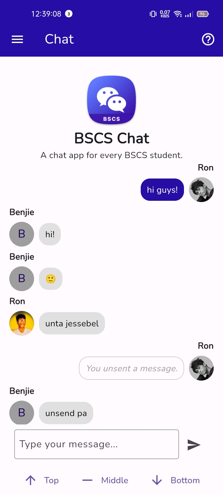

#  BSCS Chat - A realtime Flutter app chat

## 📷 App Screenshots

    

    

    

 

> This README provides comprehensive instructions on how to build, locate, and install the debug version of our Android mobile application. Designed for user-friendliness, this guide is suitable for individuals with varying levels of technical knowledge in mobile app development.

## Prerequisites

> [!IMPORTANT]
Before starting, make sure you have:
- Flutter SDK installed
- Android Studio or Visual Studio Code with Flutter and Dart plugins
- An Android device or emulator for testing

## 📱 Building the App

1. **Clone the Repository**: Start by cloning the project repository to your local machine.

2. **Open the Project**: Open the project in Android Studio or Visual Studio Code.

3. **Fetch Dependencies**: Use the terminal to run `flutter pub get`, fetching all the necessary project dependencies.

4. **Run the App**: Build and run the app in debug mode by executing `flutter run`.

5. **APK Build Location**: The debug APK will be located at: `√ Built build\app\outputs\flutter-apk\app-debug.apk`.

## 🔎 Locating the Built App

The debug APK can be found in the `build\app\outputs\flutter-apk` directory of your project folder. Navigate here using a file explorer.

Alternatively, you can directly download the APK and install the app on your phone by enabling 'Unknown Sources' for app installation. The APK is available at: [My Drive](https://drive.google.com/file/d/1vY34rLhJOWCJU8JyxwhuFMG6ZZj4nnTn/view?usp=drive_link).

## 🔨 Installing the App on an Android Device

1. **Enable Developer Mode**: On your Android device, go to `Settings > About phone` and tap `Build number` 7 times to enable developer mode. Then, activate `USB debugging` in `Settings > Developer options`.

2. **Connect Device to Computer**: Connect your Android device to your computer using a USB cable.

3. **Transfer the APK**: Find `app-debug.apk` in your project directory and transfer it to your device.

4. **Install the App**: Use a file manager on your device to locate and open the APK file, then follow the prompts to install it.

5. **Open the App**: Once installed, the app will appear in your device's app drawer.

## 🛠 Troubleshooting

If you encounter any issues, consult the Flutter [official documentation](https://flutter.dev/docs) or reach out to me at my GitHub profile: [@ronhedwigzape](https://github.com/ronhedwigzape).

> [!NOTE]
This guide is designed to assist you in successfully building and installing my Flutter application. Thank you for your interest in my project!
